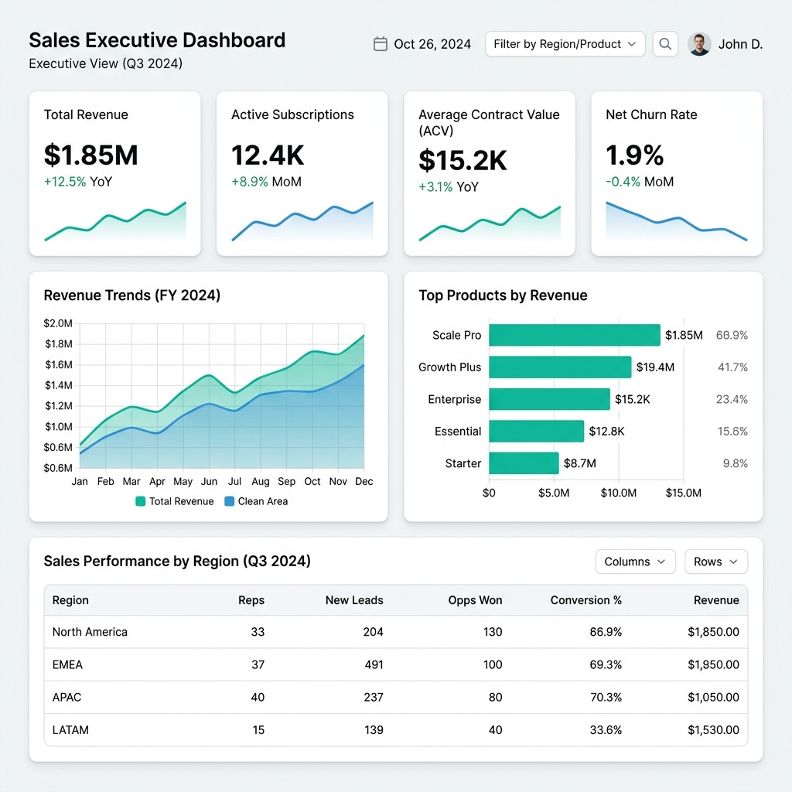
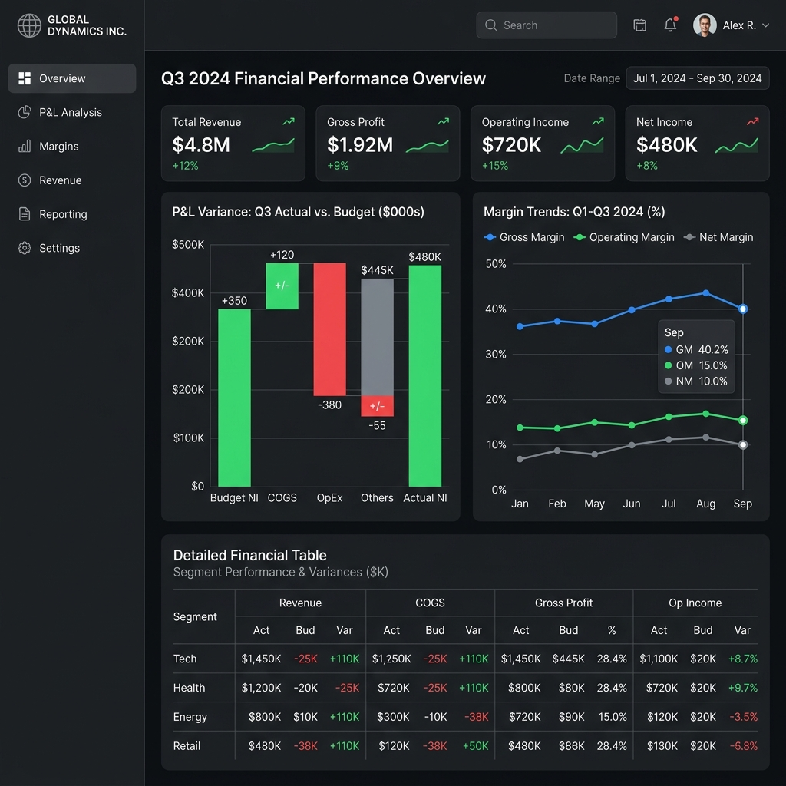
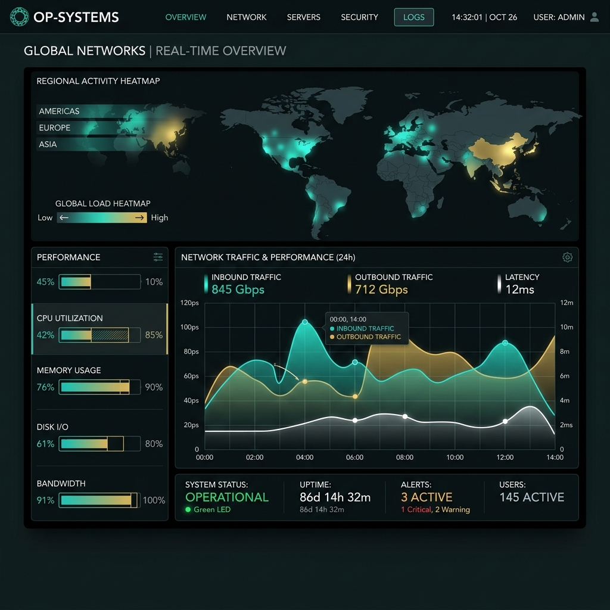

# Apex Elite AI Data Analyst + Data Visualization Skill

Welcome to the **Apex Elite AI Data Analyst + Data Visualization Skill** repository. This project aims to transform an AI model into a senior-level Data Analyst, Dashboard Designer, and Data Storyteller.

> **DO NOT SIMPLY VISUALIZE DATA. VISUALIZE MEANING.**

## Current State & Capabilities

This skill is actively undergoing a massive overhaul to reach Apex-level intelligence. It is designed around a highly modular, 7-Phase architecture that enforces rigorous analytical logic, strict QA matrices, and advanced visual grammar.

### 1. Phase A: Foundation
- **Metric Definition**: Enforces strict numerator, denominator, grain, and filter definitions for all KPIs.
- **Data Grain & Join Audit**: Validates multi-table merges to prevent Cartesian explosions and fan-outs.
- **Provenance & Assumptions**: Tracks complete data lineage and enforces contextual (not blind) missing-data imputation.

### 2. Phase B: Analytical Brain
- **Advanced Stats & Diagnostics**: Performs variance decomposition, hypothesis testing, and residual diagnostics.
- **Segmentation & Cohorts**: Deep behavioral clustering and funnel drop-off analysis.
- **Forecasting**: Decomposes trend, seasonality, and noise with proper prediction intervals.

### 3. Phase C: Visualization Brain
- **Full Chart Taxonomy**: Supports advanced charts including Ridgeline, ECDF, Beeswarm, Hexbin, Marimekko, Sankey, Alluvial, and Forest plots.
- **Visual Grammar Engine**: Maps meaning to encoding (position, length, area, color) based on precision requirements, rejecting inappropriate requests.
- **Custom Creativity**: Modifies and combines standard charts (e.g., Scatter + Marginals) without sacrificing truth.

### 4. Phase D: Dashboard Brain
- **Decision-First Architecture**: Abandons KPI-dump templates in favor of audience-and-decision-driven hierarchies.
- **Density Intelligence**: Adapts visual density for executives vs. operational teams.

### 5. Phase E: Design Brain
- **Reference-Derived Themes**: Employs SaaS Clean, Corporate High-Density, and Cinematic Dark patterns extracted from professional dashboard references.

### 6. Phase F: Quality Brain
- **Layered QA Matrices**: Checks Data, Calculation, Visuals, Design, and Story layers.
- **Self-Critique Loop**: Forces the AI to iterate through `CRITIQUE -> WHY -> SEVERITY -> FIX -> COMPARE -> PASS` before finalizing outputs.

### 7. Phase G: Proof
- Contains definitions for adversarial tests (e.g., handling missing data, rejecting bad chart requests) and real-world analytical examples.

## Example Dashboards Generated by This Skill

Here are some examples of the visual intelligence and design capabilities this skill imbues:

### 1. Modern SaaS Executive Sales Dashboard


### 2. Corporate Financial Performance Dashboard


### 3. Cinematic Operational Network Dashboard


## Architecture Tree

```text
data-analyst-visualization-skill/
├── SKILL.md
├── foundation/ 
├── analytical/ 
├── visualization/ 
├── dashboards/ 
├── design/ 
├── quality/ 
└── proof/ 
```

## Setup & Usage

To use this skill, copy the `data-analyst-visualization-skill` directory into your agent's `skills` folder. The AI should read the `SKILL.md` entry point to load all dependent logic.
