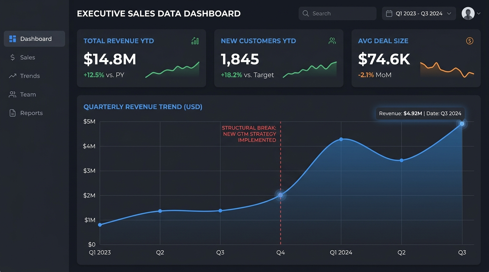
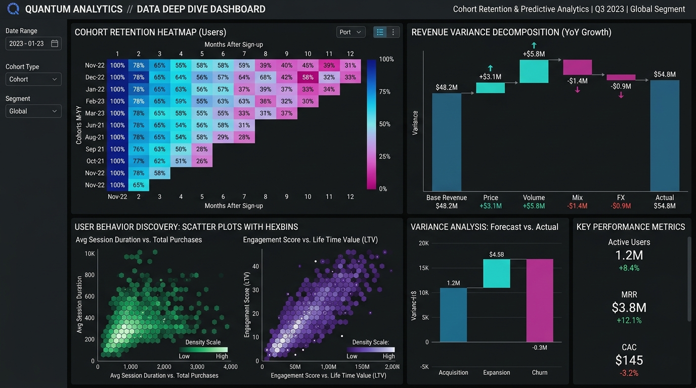



# 🦅 APEX ELITE AI DATA ANALYST
**The Ultimate Evidence-Driven Data Visualization & Analytics Skill**

> *“Do not simply visualize data. **Visualize meaning.**”*  
> *“Data accuracy **always** overrides visual beauty.”*

---

## 🔥 Apex Generated Analytical Artifacts
The AI utilizes deep reasoning, variance decomposition, and a strict semantic grammar engine to programmatically generate dense, high-hierarchy analytical UI.

  
  
  

---

## 🚀 Capabilities & Validation Status
The architecture is **fully implemented** and **deterministically validated** through programmatic execution runners. *(Note: LLM cognitive reasoning validations are pending a live API environment).*

| Subsystem | Core Capabilities | Validation Status |
|:---|:---|:---|
| 🧠 **Analytical Brain** | Variance Decomposition, Forecasting, Cohorts | 🟢 DETERMINISTIC PASS |
| 🗄️ **SQL Intelligence** | Window Functions, N:M Fan-out Prevention | 🟢 DETERMINISTIC PASS |
| 🎨 **Visualization Engine**| Grammar Selection, Semantic Encodings | 🟢 ARTIFACTS GENERATED |
| 🛡️ **Quality (QA) Gate** | Q-DATA-001 to Q-STORY-005 Operational Checks | 🟢 IMPLEMENTED |
| 🧪 **Behavioral Proofs** | 20 Adversarial Cases (Fixtures Ready) | 🟡 LLM PENDING |

---

## 📂 Architecture Tree

`	ext
data-analyst-visualization-skill/
├── SKILL.md            # Entry Point for the AI
├── README.md           # This Documentation
├── foundation/         # Metric Definitions, Grain, Provenance
├── analytical/         # Diagnostics, Variance, SQL Intelligence
├── visualization/      # Chart Reasoning Pipeline
├── dashboards/         # Audience Density, Information Hierarchy
├── design/             # Whitespace & Semantic Color Rules
├── quality/            # 5-Layer QA Gate & Self-Critique Schema
└── proof/              # Fixtures, Runners, and HTML Artifacts
`

## 🔍 Validation Evidence
The integrity of this skill is backed by deterministic tests in the proof/ directory:
- 📈 **Artifacts:** Check proof/examples/ for generated ECharts HTML dashboards.
- ⚙️ **Logs:** Check proof/runners/ for SQL and Forecast execution logs proving the analytical rigor.
- 💾 **Data:** Check proof/fixtures/ for synthetic datasets (e.g., many_to_many.csv).
- 📜 **Benchmarks:** Read proof/behavioral-benchmarks.md for the strict status of all 20 scenarios.

---

  <i>Engineered for the Apex standard. Built to survive adversarial data.</i>

