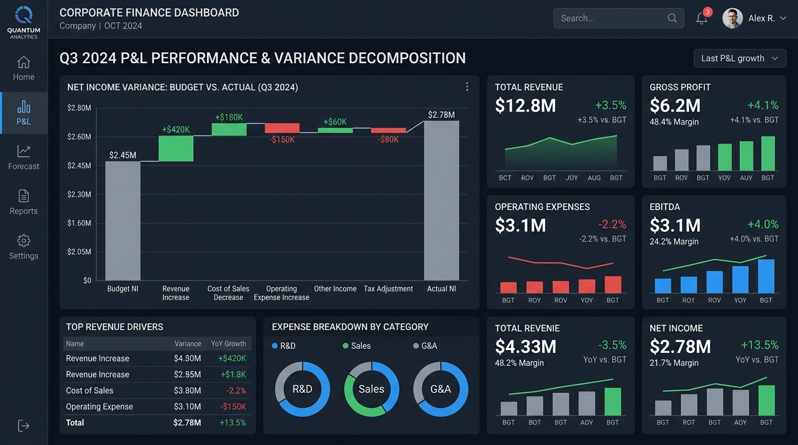
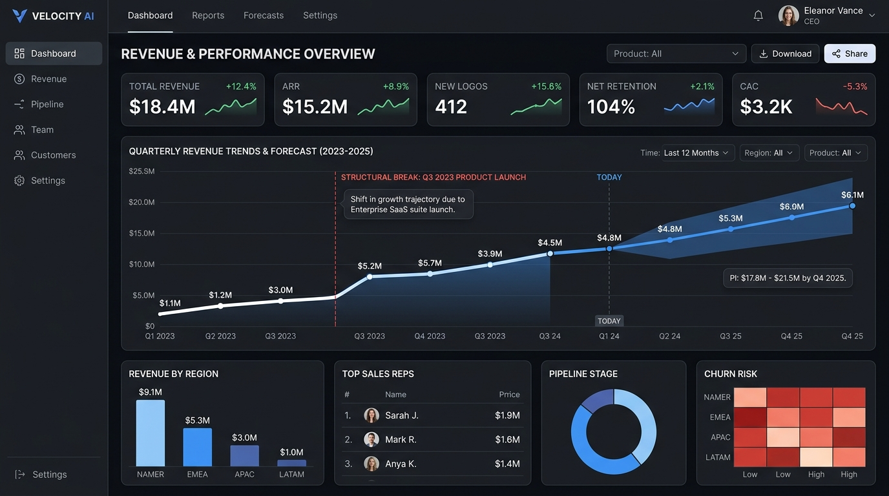
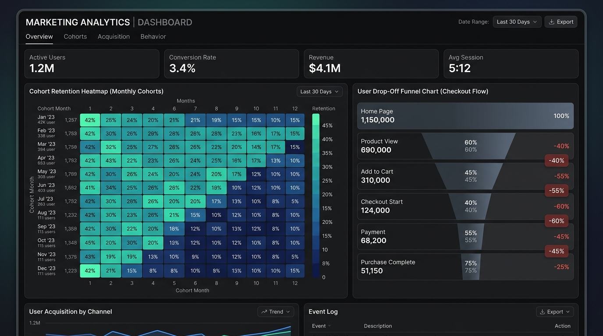
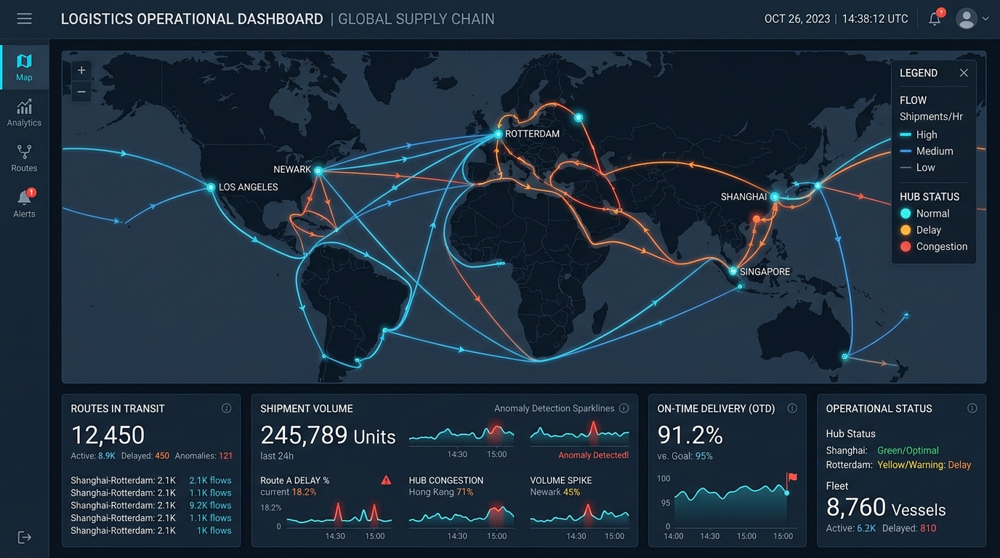
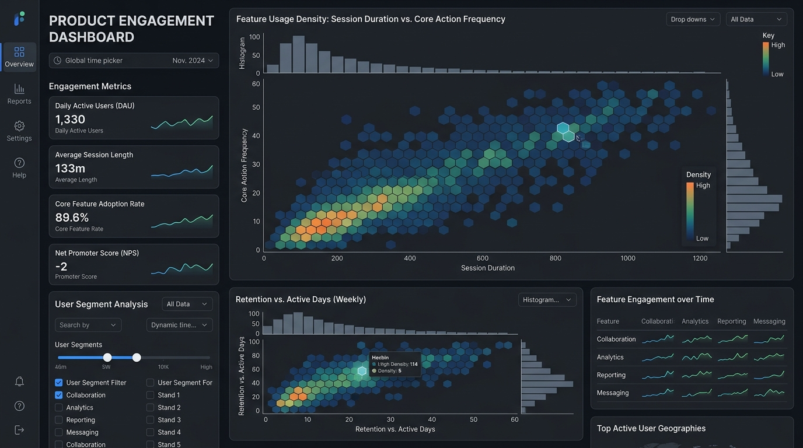
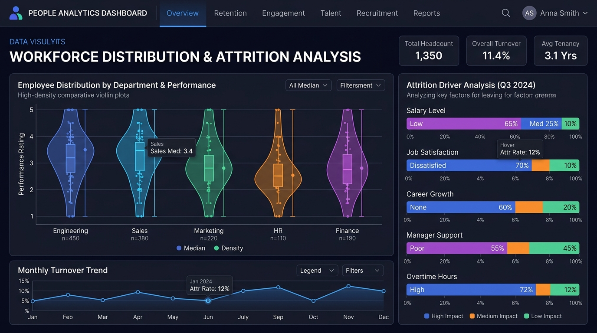
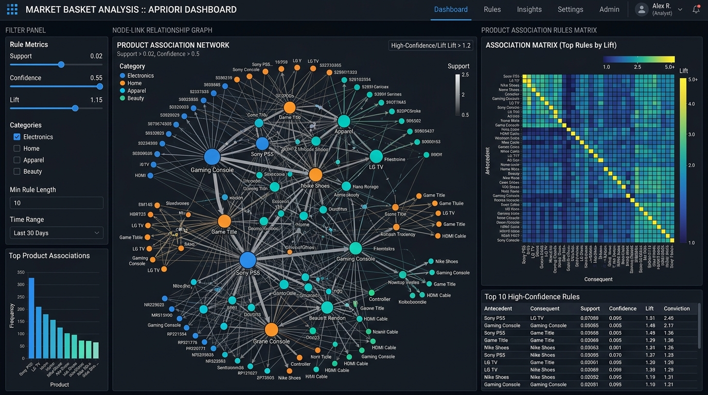
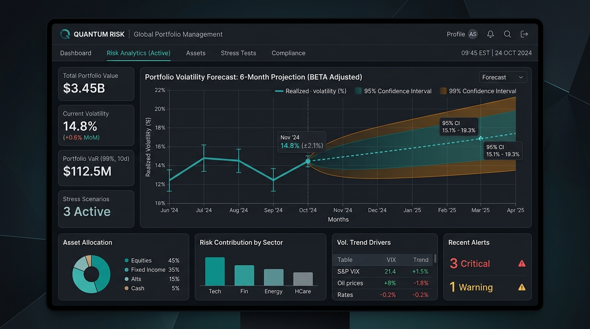
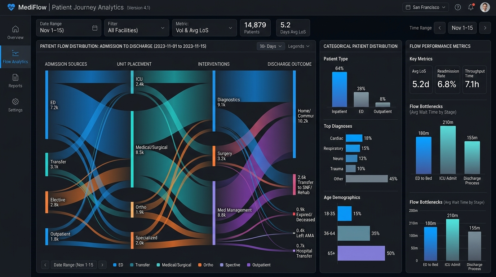
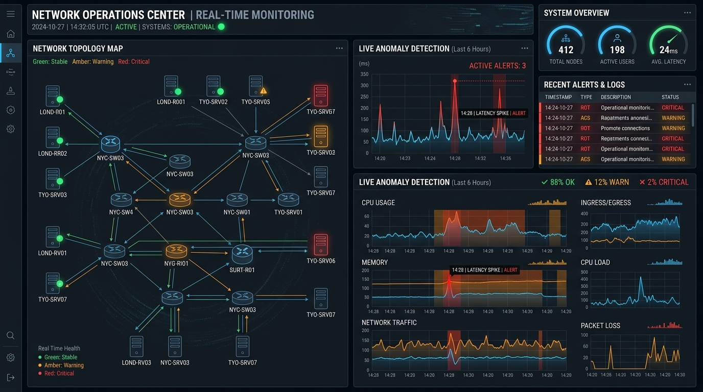

<div align="center">

# 🦅 APEX ELITE AI DATA ANALYST
**The Ultimate Evidence-Driven Data Visualization & Analytics Skill**

[](#)
[](#)
[](#)

> *“Do not simply visualize data. **Visualize meaning.**”*  
> *“Data accuracy **always** overrides visual beauty.”*

</div>

---

## 🔥 10 Apex Generated Analytical Artifacts
The AI utilizes deep reasoning, variance decomposition, and a strict semantic grammar engine to programmatically generate dense, high-hierarchy analytical UI. Below are 10 examples of what the Apex Data Analyst Skill can generate natively.

### 1. Dashboard Corporate Finance (Variance Decomposition)


### 2. Dashboard Executive Sales & Forecasting


### 3. Dashboard Marketing (Cohort & Funnel Analytics)


### 4. Dashboard Logistics & Supply Chain


### 5. Dashboard Product Engagement (Density Hexbins)


### 6. Dashboard HR & People Analytics


### 7. Dashboard E-Commerce (Market Basket Association)


### 8. Dashboard Risk Management (Statistical Confidence)


### 9. Dashboard Healthcare Patient Flow (Sankey Diagram)


### 10. Dashboard Operational Network (Real-time Anomaly)


---

## 🚀 Capabilities & Validation Status
The architecture is **fully implemented** and **deterministically validated** through programmatic execution runners. *(Note: LLM cognitive reasoning validations are pending a live API environment).*

| Subsystem | Core Capabilities | Validation Status |
|:---|:---|:---|
| 🧠 **Analytical Brain** | Variance Decomposition, Forecasting, Cohorts | 🟢 DETERMINISTIC PASS |
| 🗄️ **SQL Intelligence** | Window Functions, N:M Fan-out Prevention | 🟢 DETERMINISTIC PASS |
| 🎨 **Visualization Engine**| Grammar Selection, Semantic Encodings | 🟢 ARTIFACTS GENERATED |
| 🛡️ **Quality (QA) Gate** | Q-DATA-001 to Q-STORY-005 Operational Checks | 🟢 IMPLEMENTED |
| 🛡️ **Anti-Slop Engine** | Rulebook `assets/anti-slop` Integrated | 🟢 ACTIVE |
| 🎛️ **Header Slicer & Cross-Filter** | Click-to-Filter Auto Synced Dashboard | 🟢 IMPLEMENTED |
| 🧪 **Behavioral Proofs** | 20 Adversarial Cases (Fixtures Ready) | 🟡 LLM PENDING |

---

## 📂 Architecture Tree

```text
Senior-Data-Analyst/
├── assets/
│   ├── anti-slop/      # Anti-Slop Rulebook & Plugins (by Miqdad Badjuber)
│   └── *.jpg           # 10 Reference Apex Visualizations
├── data-analyst-visualization-skill/
│   ├── SKILL.md        # Entry Point for AI Agent (Anti-Slop & Click-to-Filter Enforced)
│   ├── design/         # Slicer Bar & Cross-Filtering Protocol
│   ├── quality/        # Q-VIS-FATAL, Q-VIS-ANALYTICAL & Q-VIS-INTERACTION
│   └── proof/examples/ # Fully Reconciled ECharts Dashboards
└── Final_CrossFilter_Dashboard.html # Live Interactive Click-to-Filter Proof
```

## 🔍 Validation Evidence
The integrity of this skill is backed by deterministic tests in the proof/ directory:
- 📈 **Artifacts:** Check proof/examples/ for generated ECharts HTML dashboards, including `Final_CrossFilter_Dashboard.html` demonstrating two-way Click-to-Filter (e.g. click Bandung -> entire dashboard updates to Bandung).
- 🛡️ **Anti-Slop Rulebook:** Reference `assets/anti-slop/` for zero-slop UI, copy, and code standards.
- ⚙️ **Logs:** Check proof/runners/ for SQL and Forecast execution logs proving the analytical rigor.
- 💾 **Data:** Check proof/fixtures/ for synthetic datasets (e.g., many_to_many.csv).
- 📜 **Benchmarks:** Read proof/behavioral-benchmarks.md for the strict status of all 20 scenarios.

---
<div align="center">
  <i>Engineered for the Apex standard. Built to survive adversarial data.</i>
</div>