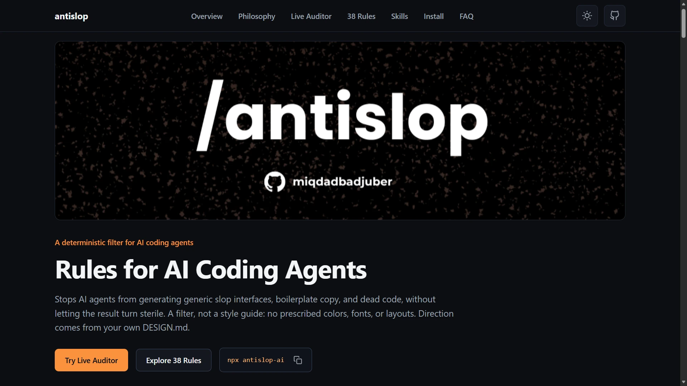
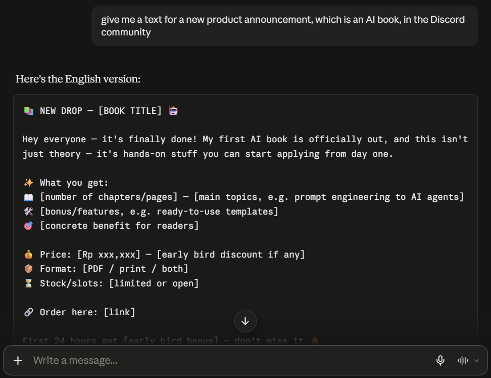
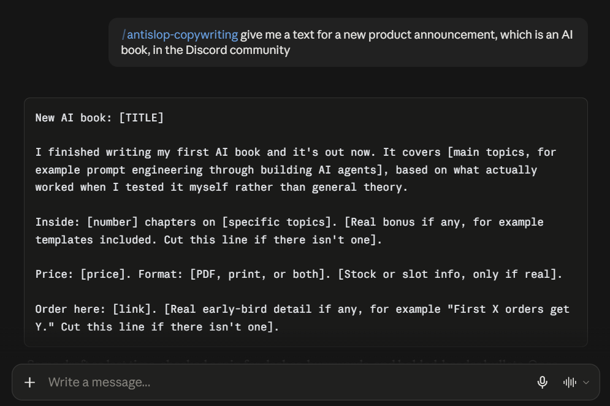
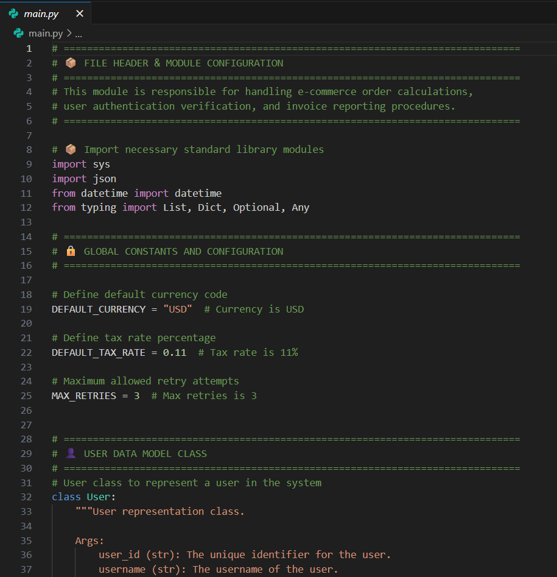
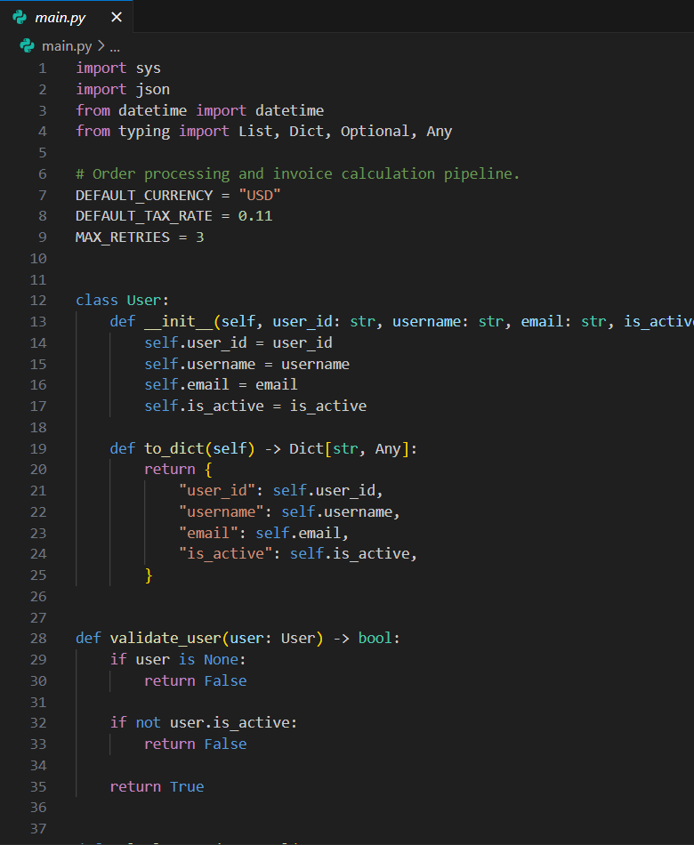

<p align="center">
  
</p>

<p align="center">
  <a href="LICENSE"></a>
  <a href="https://github.com/miqdadbadjuber/anti-slop/releases"></a>
</p>

<p align="center">
  <a href="https://skills.sh/miqdadbadjuber/anti-slop"></a>
</p>

<h1 align="center">Anti Slop: Rules for AI Coding Agents</h1>

<p align="center">
  A rulebook that stops an AI coding agent shipping generic UI, filler copy, and AI-shaped code.<br>
  A <strong>filter, not a style guide</strong>: no prescribed colors, fonts, or layouts, and direction stays yours.
</p>

<p align="center">
  <strong>New here?</strong> <a href="GUIDE.md">GUIDE.md</a> is the from-zero walkthrough.
</p>

## See the difference

The same brief, built four ways. antislop filters and `DESIGN.md` supplies direction. They are different jobs, and these are the four results.

### UI

| **Nothing at all** | **antislop alone** | **`DESIGN.md` alone** |
|:--|:--|:--|
| <a href="assets/compare/ui/without.webp"></a> | <a href="assets/compare/ui/w-antislop.webp"></a> | <a href="assets/compare/ui/w-design.webp"></a> |
| Where most AI output starts: a sparkle logo, a beta pill, and a fake terminal. | Honest, because the filter removed the invented numbers. Plain, because beauty is not its job. | The direction lands, but the slop stays, because `DESIGN.md` directs and does not filter. |

The fourth is the only one of the four that is clean and directed at the same time:

| **antislop + `DESIGN.md`** |
|:--|
| <a href="assets/compare/ui/w-all.webp"></a> |
| Honest numbers and a real direction in the same build. The filter removes what should not be there; `DESIGN.md` fills the space that leaves, which is the one thing neither manages alone. |

### Copy

One prompt, run twice.

| Before | After |
|:--|:--|
| <a href="assets/compare/text/before.webp"></a> | <a href="assets/compare/text/after.webp"></a> |

### Code

One file, run twice.

| Before | After |
|:--|:--|
| <a href="assets/compare/code/before.webp"></a> | <a href="assets/compare/code/after.webp"></a> |

Every image here opens full size if you click it.

## Install

antislop ships as standard agent skills: one folder per skill, holding a `SKILL.md`. Installation differs per agent, so pick the section for the one you use. Each route is walked through from zero, with update and removal, in [GUIDE.md](GUIDE.md#install-update-and-remove).

### The installer (recommended)

One command, then answer the prompts. It asks which skills you want, where to install them (this project or everywhere), and which agents you use, then copies the folders and writes the pointer that reloads antislop every session.

```bash
npx antislop-ai
```

### The skills directory

antislop is listed on [skills.sh](https://skills.sh/miqdadbadjuber/anti-slop), the open directory for agent skills. This copies the same folders as the installer and nothing else, so antislop reloads by description alone.

```bash
npx skills add miqdadbadjuber/anti-slop
```

### Claude Code - Plugin

```text
/plugin marketplace add https://github.com/miqdadbadjuber/anti-slop
/plugin install antislop@anti-slop
```

### Antigravity - Plugin

```bash
agy plugin install https://github.com/miqdadbadjuber/anti-slop
```

### Codex - Plugin

```bash
codex plugin marketplace add miqdadbadjuber/anti-slop
codex plugin add antislop@anti-slop
```

### Cursor - Plugin

```bash
agent plugin marketplace add https://github.com/miqdadbadjuber/anti-slop
```

Then open **Customize**, find **antislop**, and select **Install**.

### Kimi Code - Plugin

```text
/plugins install https://github.com/miqdadbadjuber/anti-slop
```

### Cline - Plugin

```bash
cline plugin install https://github.com/miqdadbadjuber/anti-slop.git
```

This door covers the Cline CLI. For the VS Code or JetBrains extension, use the installer.

### Oh My Pi - Plugin

```bash
omp plugin marketplace add miqdadbadjuber/anti-slop
omp plugin install antislop@anti-slop
```

### Pi - Package

```bash
pi install git:github.com/miqdadbadjuber/anti-slop
```

### The single file

`antislop.md` on its own is a complete filter you can paste into any chat window, with no packaging and no folders.

```bash
curl -o antislop.md https://raw.githubusercontent.com/miqdadbadjuber/anti-slop/main/antislop.md
```

## What it does

- **38 mandatory rules** (R-01 to R-38) in three tiers: Hard Gate, Purpose-Gate, and Quality Locks.
- **A Liveliness Toolkit**: three dials (ENERGY / RHYTHM / MOTION) and a Design Read, so the result comes out alive rather than merely clean.
- **A Delivery Gate**: a mandatory PASS/FAIL report in four blocks, run before anything ships.
- **Six skills**, one per concern, so an agent loads only what a task needs.

The core prevents slop but cannot invent direction. `DESIGN.md` (yours) supplies it, and a sterile result means the direction was missing, not that the filter failed (R-37). antislop never beautifies on its own.

## Skills

| Skill | Covers | Pick it for |
|-------|--------|-------------|
| antislop | The core filter: rules, tiers, the Delivery Gate, liveliness | Everything. Always loaded |
| antislop-ui | Layout, color, components, decoration, motion, structure | UI and visual work |
| antislop-copywriting | Headlines, CTAs, tone, fake stats, anti-AI writing, markdown hygiene | Copy and text |
| antislop-human | Contrast, keyboard, focus, states | Accessibility |
| antislop-layoutmobile | Reflow across screen widths, breakpoints, grids, overflow, tap targets | Responsive work |
| antislop-code | AI-slop comments: which to remove, which to keep | Comment cleanup |

Install one, several, or the core alone.

## Usage modes

antislop runs one of two ways, and by default the agent asks which at the start of every session. Both end with a report you can check; they differ in when the rules apply.

- **During** guides the work while it is built, and the session closes with the Delivery Gate report. Use it when you are building something new.
- **After** audits work that already exists: a numbered findings list, you approve which to fix, then a follow-up report. Use it to clean up output you already have.

Saving a preference is opt-in. With no settings file, antislop keeps asking in every new session exactly as it does today. Save your preferred mode once to skip that question:

```bash
npx antislop-ai --mode during
```

Use `after` instead for audits, `ask` to restore the question in every session, or `--mode` alone to view the setting. The file is shared, so one command covers every agent and every project: `~/.config/antislop/settings.json` on Linux and macOS, `%APPDATA%\antislop\settings.json` on Windows.

A mode you ask for in the current chat always wins for that session and never changes what is saved. When a saved preference applies, the skill says so once: **"antislop active: during (global preference)."** Older installs still carry the unconditional question, so run the update below to pick this up.

## Update

antislop does not update itself. If you installed through the installer, one command replaces what is already there, in this project and under your home directory, and prints the release it replaced:

```bash
npx antislop-ai --update
```

A plugin keeps its own copy under the agent that installed it, so it updates through its own command, and the Pi package updates through Pi. Every route is listed in [GUIDE.md](GUIDE.md#install-update-and-remove). Skills load when a session starts, so start a new one afterwards.

## FAQ

**Is antislop a style guide?**
No, a filter. It rejects technique without purpose and requires liveliness. Direction is yours.

**Which agents does it work with?**
Claude Code, Codex, Antigravity, OpenCode, Cursor, Cline, Amp, Gemini CLI, Hermes, GitHub Copilot, Kimi Code, Pi, and Oh My Pi. The installer covers twelve of them and detects which ones you have, and the plugin doors install from this same repository. [GUIDE.md](GUIDE.md) lists the folder each agent reads.

**What is a skill?**
A folder that goes deeper into one concern, holding a `SKILL.md` with its rules. Skills reference the core rules by number and never duplicate them, so adding one does not change the core.

## Roadmap

**v3.2.20** adds opt-in usage-mode preferences and announces the active mode and its source. It builds on the v3.2.19 changes:

- **The community files.** CONTRIBUTING.md, CODE_OF_CONDUCT.md, issue templates, and a pull request template, so the repository reads as one you can join and not only one you can install.
- **A README rebuilt.** One heading per install route, and the detail that used to be repeated here moved to the guide, where it is written out in more depth.
- **A guide rebuilt.** One section per route, so install, update, and removal sit together instead of being written out three times, and a catalogue of every named pattern generated from the skills themselves and checked in CI.

Every earlier release, and what comes next, is in [ROADMAP.md](ROADMAP.md).

## Star History

[](https://star-history.com/#miqdadbadjuber/anti-slop&Date)

## Contributors

Thanks to everyone who helps make antislop better.

<p align="center">
  <a href="https://github.com/miqdadbadjuber/anti-slop/graphs/contributors">
    
  </a>
</p>

Found a new slop pattern, a rule that missed something, or a bug in the installer? Open an [issue](https://github.com/miqdadbadjuber/anti-slop/issues). What a pull request has to carry is in [CONTRIBUTING.md](CONTRIBUTING.md), and behavior in issues and pull requests is covered by [CODE_OF_CONDUCT.md](CODE_OF_CONDUCT.md).

<hr>

<p align="center"><em>“antislop is a filter, not magic.<br>
It clears the slop from your UI, text, and code.<br>
A beautiful UI is <code>DESIGN.md</code>'s job, and yours.”</em></p>

<hr>

## License

MIT: [LICENSE](LICENSE)
