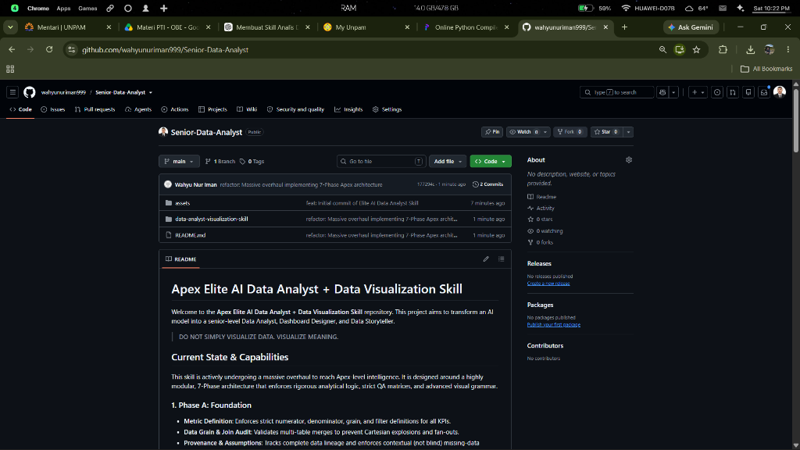

# Apex Data Analyst & Visualization Skill

**Status:** IMPLEMENTED & PARTIALLY VALIDATED

This repository contains the architecture for the Apex Data Analyst intelligence system. The architecture is implemented and deterministic validation has passed; LLM cognitive validation remains NOT EXECUTED pending a live-runtime environment.

## 🚀 Generated by Apex Skill
*(Latest analytical visual reasoning output)*

## Reference Dashboard Styles
*(Reference Dashboard Styles used by the Design Engine to guide programmatic visualization)*

### 1. Modern SaaS Executive Sales Dashboard

### 2. Corporate Financial Performance Dashboard

### 3. Cinematic Operational Network Dashboard

> **DO NOT SIMPLY VISUALIZE DATA. VISUALIZE MEANING.**
> **DATA ACCURACY ALWAYS OVERRIDES VISUAL BEAUTY.**

## Capabilities & Validation Status
- **Foundation & Analytical Engines**: IMPLEMENTED & DETERMINISTIC VALIDATION PASSED (SQL and Forecasting verified via execution runners).
- **Visualization & Dashboard Engines**: IMPLEMENTED & DETERMINISTIC VALIDATION PASSED (Real visual artifacts generated in proof/examples).
- **QA Engine**: IMPLEMENTED (Complete Q-DATA-001 to Q-STORY-005 rule matrix mapped).
- **Behavioral Benchmarks**: IMPLEMENTED (Fixtures created. Core SQL/Forecast/Vis tests executed. LLM COGNITIVE VALIDATION NOT EXECUTED).

## Evidence
- Check proof/examples/ for actual generated dashboard artifacts (HTML).
- Check proof/runners/ for SQL and Forecast execution logs proving the analytical methodologies.
- Check proof/fixtures/ for the synthetic datasets used in testing.
- Check proof/behavioral-benchmarks.md for the exact strict status mapping of all 20 behavioral scenarios.